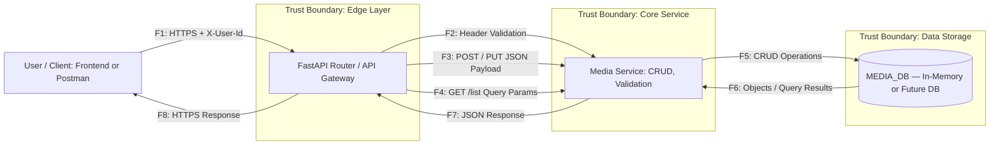
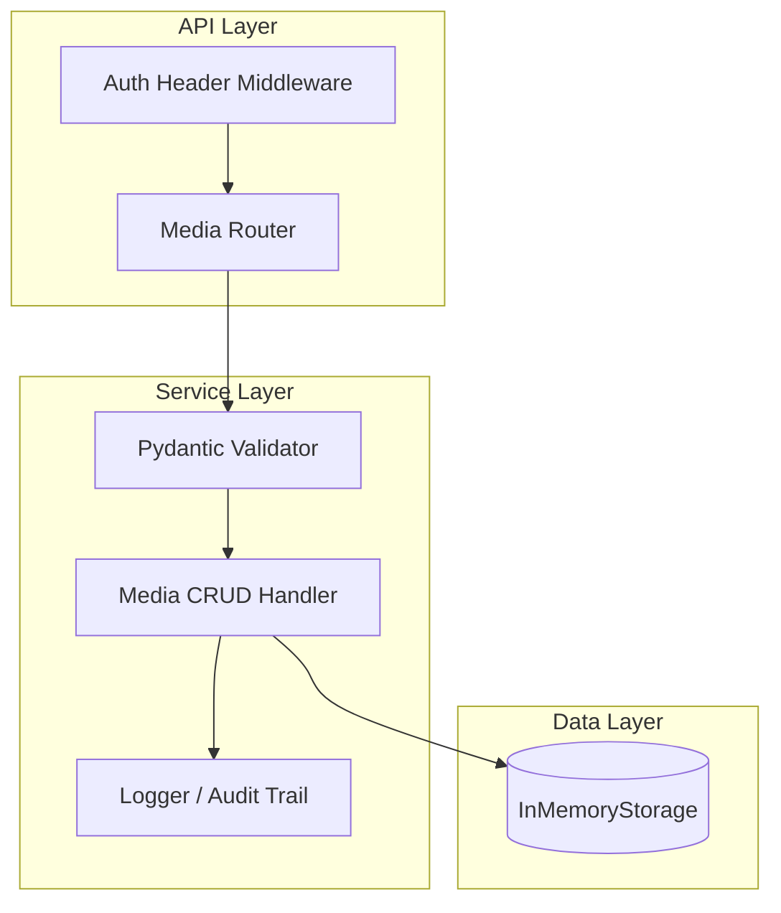

# DFD — Data Flow Diagram (Media Catalog Service)

| ID | Описание потока                    | Тип данных                | Канал            | Примечание                    |
| -- | ---------------------------------- | ------------------------- | ---------------- | ----------------------------- |
| F1 | Клиент → API: запрос с `X-User-Id` | Метаданные аутентификации | HTTPS            | Симуляция авторизации         |
| F2 | API → Service: валидация заголовка | User ID                   | Внутренний вызов | Проверка авторства            |
| F3 | API → Service: POST/PUT JSON       | Media объект              | HTTP Body        | Потенциальный ввод            |
| F4 | API → Service: GET Query params    | Query                     | HTTP             | Фильтрация, сортировка        |
| F5 | Service → DB: CRUD операции        | dict                      | Внутренний канал | CRUD по owner_id              |
| F6 | DB → Service                       | dict                      | Внутренний канал | Данные по ID                  |
| F7 | Service → API                      | JSON                      | Внутренний вызов | Фильтрация результатов        |
| F8 | API → Клиент                       | JSON                      | HTTPS            | Возврат только своих объектов |
